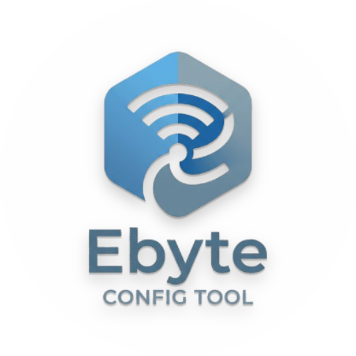

# RF Setting Ebyte

**RF Setting Ebyte** is a web app to configure **E22-E9X(SL)** LoRa modules from the browser (similar to the desktop RF Setting tool)—**no native install**. Open it in **Chrome** or **Edge** and connect over **Web Serial** (USB‑serial).

Repository folder name may still be `ebyte-config-tool`; the product name shown in the UI is **RF Setting Ebyte**.




## Features

- Open / close USB-serial via **Web Serial API**
- **Get Param** — read module registers (address, NETID, UART, air rate, power, channel, …)
- **Set Param** — write configuration (permanent)
- **Param Reset** — factory defaults
- **Save / Load** JSON presets
- Reads module PID
- Bands: **E22-400 / 900 / 230**
- **Remote configuration** tab (experimental)
- **Download mode** — raw hex for testing
- **Multi-device terminal** — choose **1–6** devices, create panels, then each slot gets its own RX log + send (text or hex, optional LF)
- **Theme**: dark / light / system (auto)
- Activity log with TX/RX hex

## Requirements

- Chromium browser: **Chrome**, **Edge**, **Opera**, or **Brave** (89+). Safari and Firefox do not support Web Serial yet.
- **E22** module on a USB-serial adapter (FT232, CP210x, CH340, …).
- Config straps: **`M0 = 1`, `M1 = 1`**.

## Run locally

### Option A — open the file

```bash
open index.html       # macOS
xdg-open index.html   # Linux
start index.html      # Windows
```

> Some Chrome builds need a flag for Web Serial on `file://` — see `chrome://flags/#enable-experimental-web-platform-features`.

### Option B — local server (recommended)

```bash
cd ebyte-config-tool
python3 -m http.server 8000
# or: npx serve .
```

Open <http://localhost:8000>.

### Option C — deploy

Static files only — deploy to GitHub Pages, Vercel, Netlify, etc.

## Quick start

1. Wire the module for config mode: `M0=1`, `M1=1`.
2. Pick the **Module** variant (400 / 900 / 230).
3. **Open Port** and select the USB-serial device.
4. **Get Param** to fill the form from the module.
5. Edit and **Set Param** to save to flash.
6. Optionally **Save File** for a JSON backup.
7. **Close**, then set `M0=0`, `M1=0` for normal operation.

## Protocol frames

| Action | TX frame (hex) |
| ------ | -------------- |
| Get Param | `C1 00 09` |
| Set Param (permanent) | `C0 00 09` + 9 data bytes |
| Set Param (volatile) | `C2 00 09` + 9 data bytes |
| Get product info | `C1 80 07` |

Nine data bytes (after header): ADDH, ADDL, NETID, REG0, REG1, REG2 (channel offset), REG3, CRYPT_H, CRYPT_L.

## Limitations

- Ports are not listed in the UI; the browser shows a picker (security model).
- Remote tab is experimental; public docs for `0xCF 0xCF` forwarding are incomplete.
- Encryption key bytes are **write-only**—they are not returned on Get Param.

## License

This project is licensed under the **Apache License, Version 2.0** — see the [`LICENSE`](LICENSE) file for the full text. Copyright and attribution notice: [`NOTICE`](NOTICE).

Third-party hardware and trademarks (e.g. EBYTE, E22) belong to their respective owners; this tool is an independent community utility.
